# Results — a figure-by-figure walkthrough

This document walks the **discrete ↔ continuous bridge** one figure at a time.
Each figure is produced by the driver of the same name (`python bridge/<name>.py`,
or regenerate all of them at once with `python repro.py`). Every driver
self-validates its identities to full precision before it plots, so each figure
doubles as a numerical certificate.

> **What this is — and isn't.** A *computational / experimental-mathematics*
> study: a unified, reproducible re-derivation that threads several **known**
> endpoints onto one explicit "restore discreteness" knob, and measures how the
> zeros respond. It is **not** a new theorem about where zeros live. The
> individual ingredients are classical and are cited as such (see the README's
> *Relation to known work*); the contribution is the synthesis, the unifying
> `O(1/K)` rate law, and a couple of spectral readings.

The knob throughout is **`K`**, the number of Fourier harmonics of the
discreteness kernel (the Euler–Maclaurin sawtooth ≡ Abel–Plana comb) that we keep.
`K = 0` is a bland, **zeroless** continuous endpoint; `K → ∞` is the genuine
Dirichlet object, with the non-trivial zeros condensed onto their lines.

---

## 1. The continuous endpoint — `cont_eta.py`

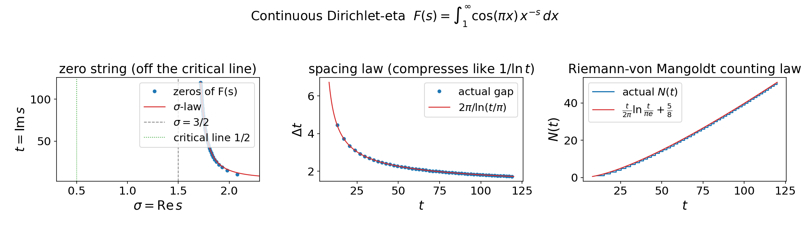

**What it shows.** Treat the alternating η-series `η(s) = Σ (−1)^{n−1} n^{−s}` as
a Riemann sum (the sign `(−1)^n = cos(πn)` at the integers) and ask for the
underlying *integral* `F(s) = ∫₁^∞ cos(πx) x^{−s} dx`. Unlike the bland zeta-side
endpoint `∫₁^∞ x^{−s} dx = 1/(s−1)` (which has **no zeros at all**), this
continuous-η object is genuinely structured: it has a closed form in incomplete
gammas, and its off-critical zero string obeys three laws confirmed numerically to
3–5 digits over `8 < t < 160` — a real-part law (`σ(t) → 3/2`), a spacing law
(`Δt ~ 2π/ln(t/π)`), and a **Riemann–von Mangoldt counting law**
`N(t) = (t/2π)ln(t/πe) + 5/8`.

**Why it matters.** It pins down what the *continuous* limit already gives you and
what it withholds. The zeros have the **right density** — the same Riemann–von
Mangoldt structure as the genuine ζ/η zeros — but they live **off** the critical
line (their real parts drift toward 3/2). So "non-trivial zeros with the right
counting law" is a property of the continuum; "those zeros sit on Re s = ½" is
exactly what *restoring discreteness* has to supply. That gap is the whole point
of the bridge.

### Preview — the two routes side by side (`comb_vs_warp.py`)

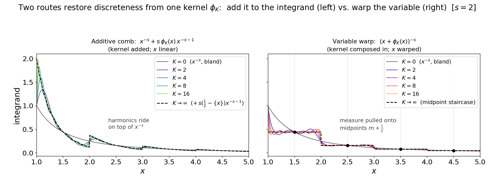

**What it shows.** The next two sections restore discreteness by two different
routes, so before either is developed this preview draws the distinction at the
level of the integrand. Both inject the **same** `K`-harmonic kernel
`φ_K(x) = Σ_{k=1}^K sin(2πkx)/(πk)` (the partial sum of the sawtooth `½ − {x}`);
they differ only in *where* it enters. The **additive comb** (§2) leaves `x` alone
and adds the kernel to the integrand, `x^{−s} + s·φ_K(x)·x^{−s−1}` — the smooth
`x^{−s}` carrying an added ripple (linear in `φ_K`). The **variable warp** (§3)
composes the kernel into the argument, `(x + φ_K(x))^{−s}` — pulling the measure
onto the cell midpoints `m + ½` so the integrand collapses toward a midpoint
staircase (nonlinear in `φ_K`). Both start at the same bland `x^{−s}` at `K = 0`.
The driver validates that each integrand's area is the real bridge object: the
additive one integrates (plus the `½` Euler–Maclaurin endpoint term) to
`harmonic_bridge.zeta_K`, and the warp one to `warp_bridge.warp_K`, both by an
independent quadrature.

**Why it matters.** "Add the kernel" vs "warp the variable" is the single most
useful thing to see clearly up front, and it is also why the two routes share the
same `O(1/K)` rate (§5): the same truncated kernel drives both. (The *coordinate*
view `n* = x + φ_K` itself — the straight line bending into the staircase — is
drawn separately by `warp_coordinate.py`, §3.)

---

## 2. The additive comb — `harmonic_bridge.py`

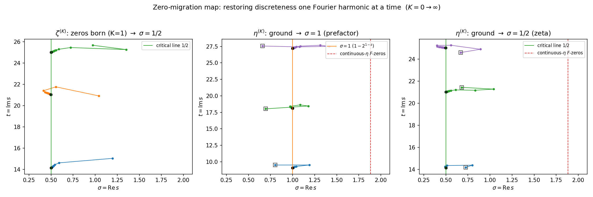

**What it shows.** Restore discreteness *additively*: add the Fourier harmonics of
the discreteness sawtooth back into the integrand, one at a time, and track each
zero as a curve in `K` — the **zero-migration map**. Two equivalent routes are
shown to agree term-by-term: the Euler–Maclaurin sawtooth `B̃₁(x) = {x} − ½` and
the Abel–Plana Bose comb `1/(e^{2πx}−1)`. For ζ, the zeroless endpoint
`1/(s−1) + ½` means the zeros are literally **born** as the first harmonic switches
on, then slide onto `σ = ½`. For η, the `K = 0` ground string **splits**: half the
zeros onto `σ = ½` (the genuine ζ zeros) and half onto `σ = 1` (the zeros of the
`1 − 2^{1−s}` prefactor, at `t = 2πm/ln2`).

**Why it matters.** This is the bridge's core mechanism made literal and the
zero-*birth* event made visible. The split is a near-**bijection of densities**:
`(t/2π)ln(t/2πe)` [critical line] + `(t ln2/2π)` [prefactor] sums to exactly the
continuous endpoint's Riemann–von Mangoldt density — so no zeros are created or
destroyed in the η migration, they are sorted onto two lines (the counting check
in the driver witnesses this).

---

## 3. The nonlinear midpoint warp — `warp_bridge.py`

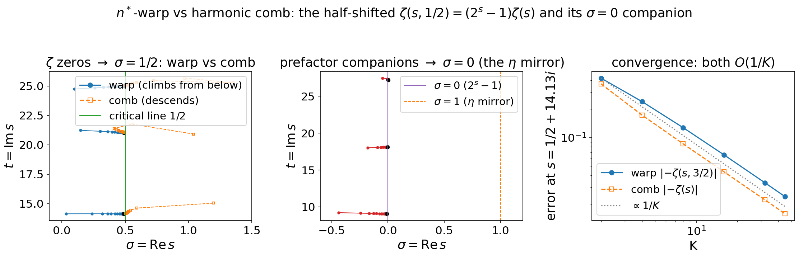

**What it shows.** A different route to the same place: instead of adding harmonics
to the integrand, **warp the integration variable** so the measure is pulled toward
integer plateaus, `n* = x + φ_K(x)`. As `K → ∞` the warp collapses each unit cell
onto its **midpoint**, so its natural target is the *half-shifted* Hurwitz zeta
`ζ(s, ½) = (2^s − 1) ζ(s)`. The genuine ζ zeros climb onto `σ = ½` — but, unlike
the comb's zeros (born high near `σ ~ 1.2` and descending), the warp's are born
**low** (`σ ~ 0`) and climb **from below**. A companion family, the zeros of the
`2^s − 1` prefactor at `t = 2πk/ln2`, migrates onto `σ = 0` — the
functional-equation mirror of η's `σ = 1` comb, at the same heights.

**Why it matters.** It shows the half-shift `(2^s − 1)ζ(s) = ζ(s, ½)` (classical:
Garunkštis–Steuding 2007; Gonek 1981) arising **deliberately and on the nose** as
the lower-endpoint "half-weight" cell of the warp, and it produces the `σ = 0`
companion line that the additive comb lacks. Two superficially different
constructions (add harmonics vs. warp the variable) reach the critical line by
**opposite approaches** — a contrast the rate law (§5) then explains quantitatively.

### Why the half-integers reproduce ζ's zeros

A fair worry: the *literal* Dirichlet series is summed over the **counting numbers**
`1, 2, 3, …` (that is the `α = 1` warp in §4), so why should the **half-integer** object
reproduce ζ's zeros and their migration at all? Because the half-integer object is not a
different beast that merely mimics ζ — it **contains ζ as a factor**, by an exact identity.
The half-integers are the odd integers rescaled by ½:

```
ζ(s, ½) = Σ_{n≥0} (n + ½)^{−s} = 2^s · Σ_{n≥0} (2n+1)^{−s} = 2^s · Σ_{odd m} m^{−s},
```

and "sum over the odds" is "all integers minus the evens":

```
Σ_{odd} m^{−s} = ζ(s) − 2^{−s} ζ(s) = (1 − 2^{−s}) ζ(s),
```

so

```
ζ(s, ½) = 2^s (1 − 2^{−s}) ζ(s) = (2^s − 1) ζ(s).
```

This is **algebra, not a limit**: summing over the half-integers equals summing over the
counting numbers times the explicit factor `2^s − 1`. The zeros therefore simply **split**,

```
zeros of (2^s − 1)·ζ(s)  =  { ζ's zeros on σ = ½ }  ∪  { zeros of 2^s − 1 on σ = 0 },
```

so the `σ = ½` family the warp migrates onto **is ζ's genuine non-trivial zero set,
identically** — not a look-alike. The half-integer lattice carries the same prime content as
ζ for every odd prime and isolates only `p = 2` (the pulled-out Euler factor `1 − 2^{−s}`),
which reappears as the `2^s − 1` companion on `σ = 0` at `t = 2πk/ln2` — the
functional-equation mirror of η's `σ = 1` comb (§6) at the same heights. Using the counting
numbers directly (`α = 1`, §4) would give plain `ζ(s)` and *only* the `σ = ½` family; the
half-shift gives the **same** critical zeros plus that explicit, fully-understood `σ = 0`
bonus — and does so from the pristine zeroless `1/(s−1)` endpoint. (This is why neither the
half-integer staircase below nor the `α` choice is a sleight of hand: the critical zeros are
ζ's own, present exactly, in every clean phase.)

### Companion — the warp coordinate, visualized (`warp_coordinate.py`)

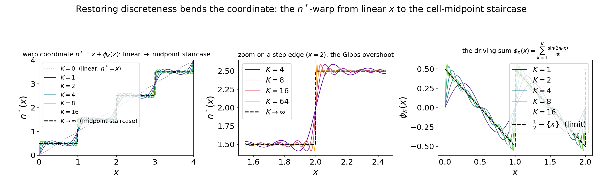

**What it shows.** A picture of the warp *itself* (not its zeros). The warp coordinate
`n*(x) = x + φ_K(x)` starts as the **linear** `x` at `K = 0` and, as Fourier harmonics are
restored, bends into the **midpoint staircase** `⌊x⌋ + ½`, collapsing each unit cell onto its
midpoint. The cell midpoints `m + ½` are exact fixed points at every `K`; between them the
curve flattens onto the tread. Because the underlying sawtooth `½ − {x}` has a unit jump at
each integer, the partial sums carry the classic ~9% **Gibbs overshoot** at the step edges
(panel b) — the little wobble-and-jump riding each step, which narrows but never vanishes.

**Why it matters.** It makes "warp the coordinate" concrete and ties two findings together:
the midpoint staircase is *why* the warp targets the half-shifted `ζ(s, ½)` (§3 above), and
the never-vanishing Gibbs boundary layer at the steps is *why* the warp's `O(1/K)` rate
constant `C_warp` is a non-elementary sine-integral rather than the comb's clean `s/2π²`
(§5 below).

### Companion — half-integers vs counting numbers: why both (`warp_phase_compare.py`)

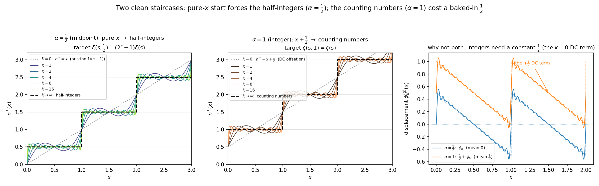

**What it shows.** A natural question about the staircase above: why does it land on the
**half-integers** (½, 3/2, …) rather than the **counting numbers** (1, 2, 3, …)? Both are
reachable — they are the `α = ½` and `α = 1` cases of the general-phase warp (§4 below),
whose cells collapse onto `⌊x⌋ + α` via the DC-shifted displacement
`φ_K^{(α)}(x) = (α − ½) + φ_K(x) → α − {x}`. The figure puts them side by side, and panel (c)
shows the obstruction to having both: the `α = ½` displacement is the **pure sawtooth** `φ_K`
(zero mean), while `α = 1` carries a constant `+½` — the `k = 0` (DC) Fourier coefficient.

**The trade-off — pristine-`x` start XOR integer steps:**

| | steps land on | `K = 0` endpoint | `K → ∞` target |
|---|---|---|---|
| **`α = ½`** (midpoint, headline) | half-integers ½, 3/2, … | **`x`** — the pristine `1/(s−1)` | `(2^s − 1)ζ(s) = ζ(s, ½)` |
| **`α = 1`** (integer) | counting numbers 1, 2, 3, … | `x + ½` (DC offset always on) | `ζ(s, 1) = ζ(s)` |

A zero-mean periodic correction added to `x` can only ever reach `⌊x⌋ + ½`. Landing on the
integers **requires** that non-trigonometric constant `½`, which means at `K = 0` you are
already at `x + ½` — no longer the bland, trig-free `x`. So you can have a **pure-`x` start**
*or* **integer steps**, not both. The half-integer midpoint is the *unique* clean staircase
reachable from a pure-`x` start by pure trigonometric corrections.

**Why it matters / implications.** This is exactly why the bridge's headline is `α = ½`:
it is the one phase that keeps the pristine zeroless endpoint `1/(s−1)` *and* lands on a clean
line — and the clean line it lands on is the **richer** half-shifted `(2^s − 1)ζ(s)`, whose
`σ = ½` zeros are ζ's own (see *Why the half-integers reproduce ζ's zeros* in §3) and which
also carries the `σ = 0` companion (the functional-equation mirror of η's `σ = 1` comb). Choosing
`α = 1` instead would recover **plain `ζ(s)`** and the literal counting numbers, but at the
cost of the pristine endpoint *and* the `σ = 0` companion (no `2^s − 1` prefactor, so no
companion line). The `O(1/K)` rate law (§5) holds for both; only the displacement constants
differ, and `warp_alpha.py` carries the general-`α` versions.

---

## 4. The general phase — `warp_alpha.py`

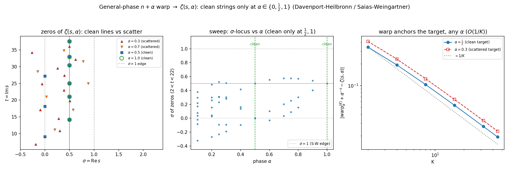

**What it shows.** Generalize the warp to pin cells to an arbitrary phase `n + α`,
`α ∈ (0,1)`, whose completed target is the Hurwitz zeta `ζ(s, α)`. Sweeping `α` and
watching where the zeros go exhibits the **Saias–Weingartner `P·L` dichotomy**:
clean vertical zero strings appear **only** at `α ∈ {0, ½, 1}` (where `ζ(s, α)`
degenerates to a polynomial-in-prime-powers times a single Dirichlet L); every
generic `α` gives a Davenport–Heilbronn-scattered set, with zeros off any line and
even into `σ > 1`.

**Why it matters.** It locates the half-shift of §3 inside a one-parameter family
and explains *why* `½` is special rather than merely chosen — it is one of the
three privileged phases, framed by the right classical results (Saias–Weingartner
2009; Davenport–Heilbronn 1936 / Cassels 1961; Garunkštis–Steuding 2007). The
"clean lines only at `{0, ½, 1}`" picture is the load-bearing control that keeps
the half-shift route honest.

### Companion — warping the η integral (`warp_eta.py`)

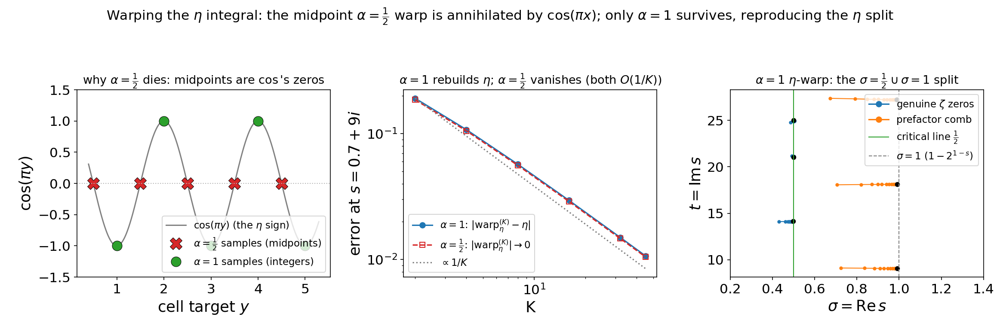

**What it shows.** The warp so far acted only on the *bland* integrand `x^{−s}`. What
happens if we warp the bridge's *structured* endpoint — the continuous-η integrand
`cos(πx) x^{−s}` (§1) — whole, both terms? As `K → ∞` each cell lands on
`cos(π(m+α))·(m+α)^{−s}`, and the phase suddenly matters:

- **`α = ½` (midpoints) is annihilated.** `cos(π(m+½)) = 0` identically — the
  half-integer lattice the midpoint warp samples is *exactly the zero set of the η
  sign-carrier* `cos(πx)` — so the warp collapses to **0** (numerically `O(1/K) → 0`).
  The elegant half-shift has nothing to land on.
- **`α = 1` (counting numbers) survives** and rebuilds `η(s) = (1 − 2^{1−s})ζ(s)`,
  whose zeros are the genuine ζ zeros on `σ = ½` **and** the `1 − 2^{1−s}` comb on
  `σ = 1` — the *same* split the additive comb produced (§2), now reached by the
  independent warp route. The omitted `n = 1` cell (`cos π · 1 = −1`) is the
  load-bearing endpoint term, the η-form of the warp's `+2^s`.

**Why it matters.** It sharpens *why* `α = ½` is the headline (§3): ζ can afford the
midpoint phase — pristine endpoint *and* a clean line — precisely because `x^{−s}`
has no zeros on the half-integer lattice. The η integrand does, so η is forced onto
`α = 1` and pays the DC-offset endpoint ζ avoided. The half-shift is a ζ-only luxury
because the discreteness it samples carries no alternating sign.

---

## 5. The unified rate law — `rate_law.py`

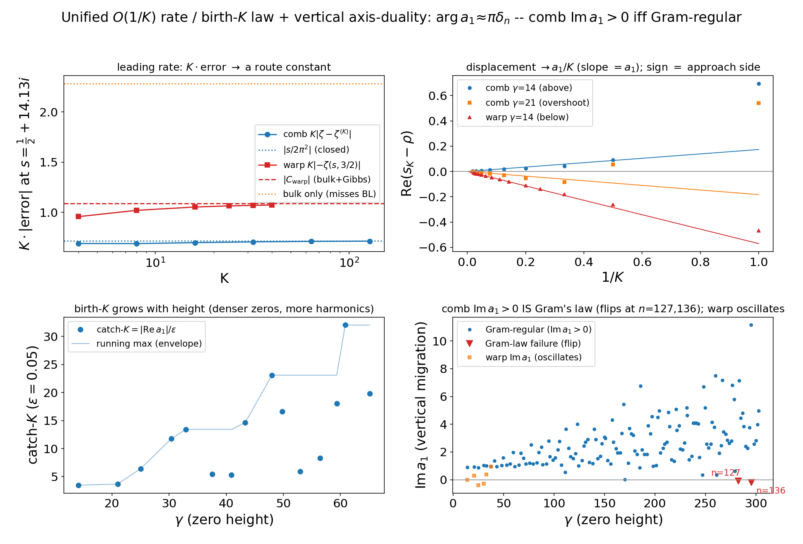

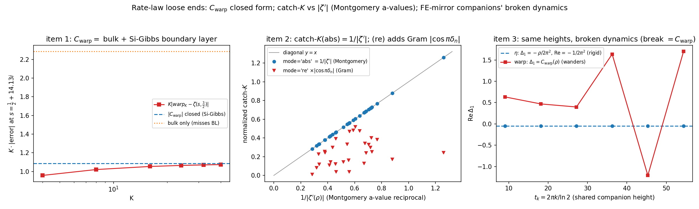

**What it shows.** One mechanism behind every route. All routes truncate the *same*
sawtooth, whose tail has power `Σ_{k>K} 1/(πk)² ~ 1/(π²K)`, so **all are `O(1/K)`**.
A single zero-displacement law `s_K − ρ ~ a₁(ρ)/K` covers all five zero families;
the **sign of `Re a₁`** is the approach side, which is why the comb descends (and
can overshoot) while the warp climbs from below and never overshoots. The
**birth-`K`** law `catch_K = |Re a₁|/ε` says which `K` first resolves a given zero.
The imaginary part `Im a₁` gives the *vertical* migration, and the headline is that
its sign is **exactly Gram's law** — it first flips at the classical Gram failures
(zeros n = 127, 136, 196). The second figure closes three loose ends: a closed form
for the warp constant `C_warp` (a Gibbs boundary-layer integral), the tie of
`catch_K` to the **Montgomery a-values** `1/|ζ′(ρ)|`, and the fact that the
`σ = 1`/`σ = 0` companions share heights but **not** migration dynamics.

**Why it matters.** This is where the package stops being four separate
demonstrations and becomes one law: a single rate constant and displacement
coefficient, route by route, plus a Gram's-law coupling on the vertical axis. It is
the synthesis the whole repo is organized around.

### Companion — stability: no abscissa, height is the cost (`stability.py`)

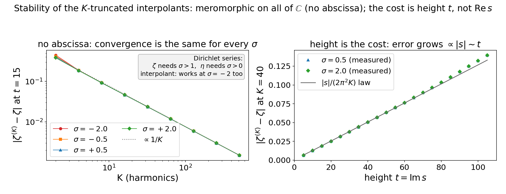

**What it shows.** A question the Dirichlet series provokes: how far into the plane
do the `K`-truncated objects stay valid? The series `Σ n^{−s}` converges only for
`Re s > 1`, the alternating η-series only for `Re s > 0` — but `ζ^{(K)}` inherits
**no such barrier**. Each `ζ^{(K)}` is `1/(s−1) + ½` plus finitely many harmonics,
every one an incomplete-gamma *closed form* (entire in `s`), so it is **meromorphic
on all of ℂ** — one pole at `s = 1`, **no abscissa of convergence**. The figure
shows the two consequences: (left) the convergence error collapses onto one `O(1/K)`
line for every `σ`, including `σ = −2` where both series diverge; (right) at fixed
`K` the error grows linearly with **height** `t`, tracking the analytic rate
constant `|s|/(2π²K)`.

**Why it matters.** It inverts the Dirichlet intuition: `Re s` is essentially free,
and the only cost is *height* — higher, denser zeros need proportionally more
harmonics (the convergence-side face of the birth-`K` law). The one genuine limit is
finite precision, itself height-set (the `e^{πt/2}` cancellations the warp evaluator
tames near `t ≈ 110`); the `O(1/K)` descent is otherwise clean, and in exact
arithmetic more harmonics always help.

### Companion — where the trivial zeros come from (`trivial_zeros.py`)

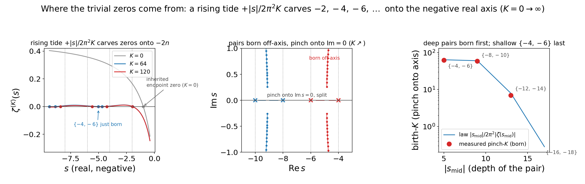

**What it shows.** The migration story so far is about *non-trivial* zeros. But ζ also
has the **trivial** zeros at `s = −2, −4, −6, …`, and the bland endpoint `1/(s−1)+½`
has none of them (it has a single real zero, at `s = −1`). Because `ζ^{(K)}` converges
with no abscissa (the stability result above), we can follow the negative real axis and
watch them appear. On that axis the `O(1/K)` tail acts as a **rising tide**,
`ζ^{(K)}(s) ≈ ζ(s) + |s|/(2π²K)`, lifting ζ uniformly upward; the lift recedes as `K`
grows and uncovers the trivial zeros. Three findings, all self-validated:

- **The first trivial zero `−2` is *inherited*, not born.** The bland endpoint's lone
  zero (`−1`) just slides leftward and limits onto `−2` as `−2 + 3.327/K` (panel a). The
  bland integral's single zero is the seed of the whole trivial string.
- **The rest are *born* as conjugate pairs that pinch onto the axis.** Below its birth-`K`
  a pair sits **off** the real axis (a complex-conjugate pair near an odd-integer
  midpoint); as `K` grows it descends, **pinches** onto `Im s = 0`, and splits — one zero
  to `−2(2j)`, one to `−2(2j+1)` (panel b). It is the trivial-zero mirror of the
  non-trivial story: *born off the locus, migrate onto it*, rotated ninety degrees (onto
  the real axis) and in pairs.
- **Depth beats shallowness — deep pairs are born first.** A pair clears the tide at
  `K_pinch ≈ |s_mid|/(2π²|ζ(s_mid)|)`, and `|ζ(−(2m+1))|` grows *factorially*, so the deep
  dips are bottomless and their pairs are present already at `K ~ 1`, while the shallowest
  dip — the first one — is the last to clear: the `{−4,−6}` pair is not born until
  `K ≈ 62` (panel c). The negative axis fills in from both ends; the hardest trivial zeros
  to resolve are `−4` and `−6`.

**Why it matters.** It closes the bridge's account of the zeros: not just the
condensation of the non-trivial zeros onto their lines, but the **birth of the trivial
zeros** out of a zeroless endpoint. And it needs no new constants — the unified
displacement law of §5 applies *verbatim* with target `ζ` and `ρ = −2n`
(`disp_coeff_trivial(n) == rate_law.disp_coeff("comb_zeta", −2n)`); what is genuinely new
on this axis is the **birth event** itself, the conjugate-pair pinch and its valley-depth
birth-`K` law, which the non-trivial families (born immediately at `K = 1`) never undergo.

---

## 6. The two-component η spectrum — `eta_two_component.py`

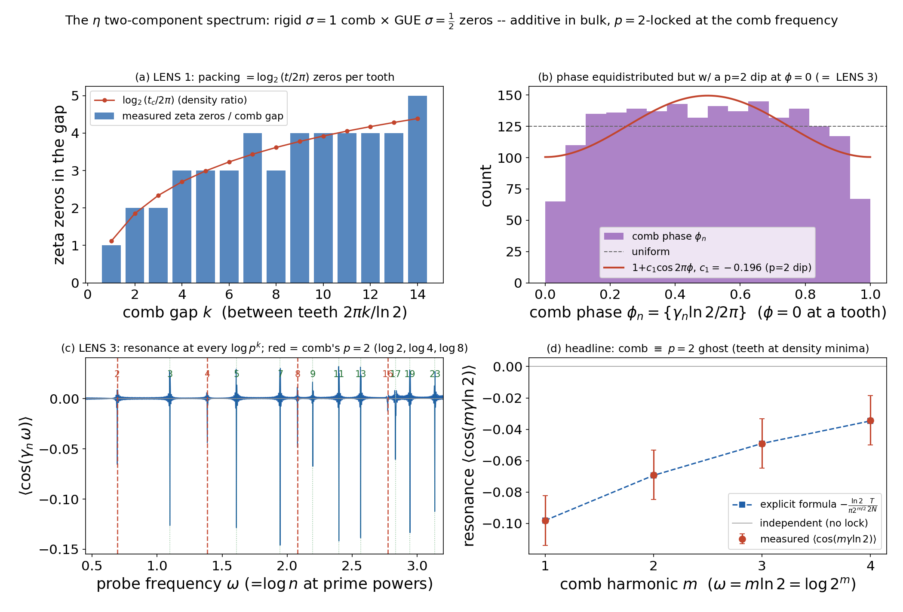

**What it shows.** Projected onto the `t`-axis, the η zero set is a **rigid
crystalline comb** (`σ = 1` teeth at `t = 2πk/ln2`, perfectly periodic)
**superposed** with a **GUE-random sequence** (the `σ = ½` ζ zeros). Three lenses:
the one-point packing (`log₂(t/2π)` zeros per comb gap, equidistributed) and the
two-point number variance both say the components are an *independent superposition*
in the smooth bulk — but the third lens shows they are **not** independent. The comb
teeth sit at the `p = 2` prime-power frequencies `m·ln2`, and by the explicit
formula the ζ-zero density carries an oscillation at every prime-power frequency, so
probing the zeros at the comb frequency **resonates**: the measured
`⟨cos(m γ ln2)⟩` matches the `p = 2^m` explicit-formula coefficient to ~4 digits,
with a negative sign (comb teeth sit at density **minima**). The `σ = 1` comb is the
"`p = 2` ghost" of the zeros' own prime structure.

**Why it matters — and the honest caveat.** The superposition-plus-resonance reading
is the spectral payoff of the η side of the bridge. But the appearance of `log 2` in
the zeros' number variance is **not** new: Berry (1988), proved by
Lugar–Milinovich–Quesada-Herrera (2022), already places prime-power log-frequencies
(smallest `= log 2`) in a regime where GUE fails. What is ours here is only the
**comb ⊎ GUE superposition** framing, the **single-prime isolation**, and the **eta
tie-in** — not the `log 2` frequency itself. (See issue #2 for the full
"what's known / what we add" statement.)

---

## Reproducing everything

```bash
python repro.py        # regenerates all twelve figures above (~20 min; harmonic/warp/eta dominate)
pytest                 # fast self-checks (the slow high-precision suite: pytest -m slow)
```

Each driver also runs standalone and prints its validation table:
`python bridge/cont_eta.py`, etc. See [`CONTRIBUTING.md`](CONTRIBUTING.md) for the
one-time environment setup.
