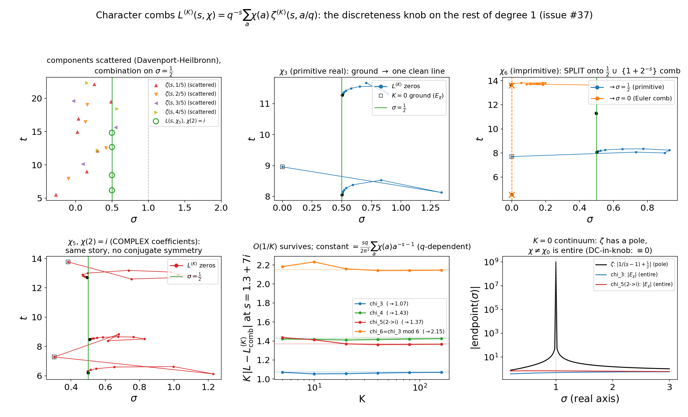
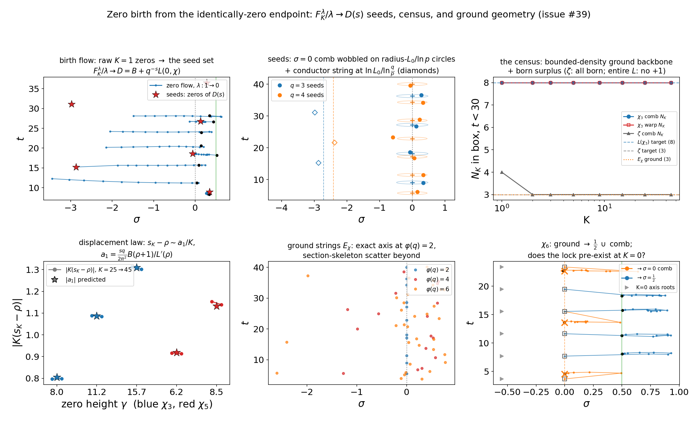
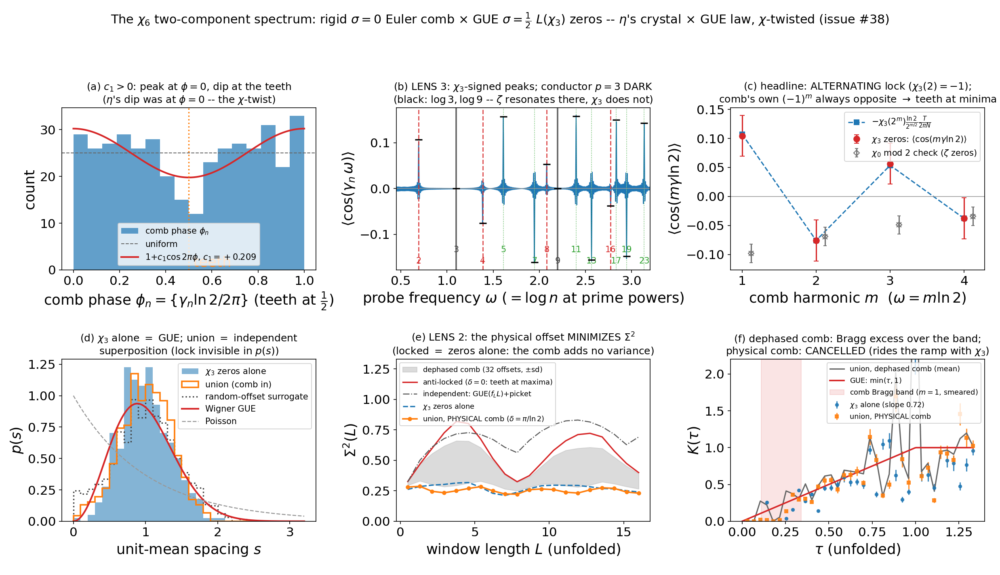
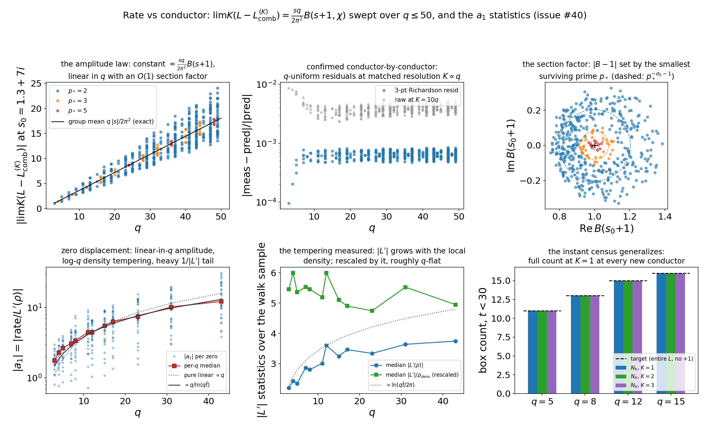
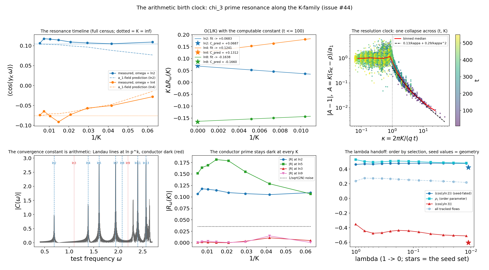
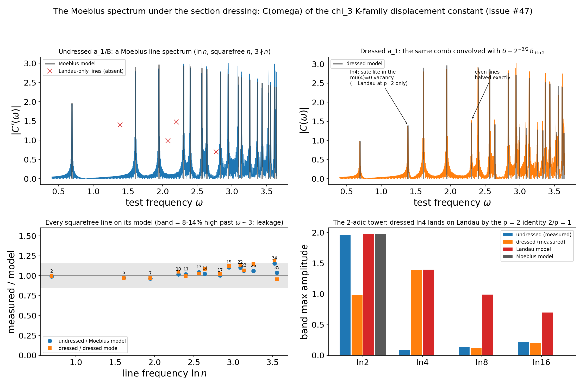
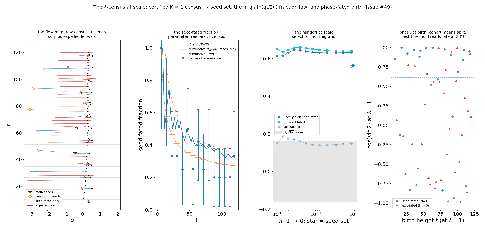
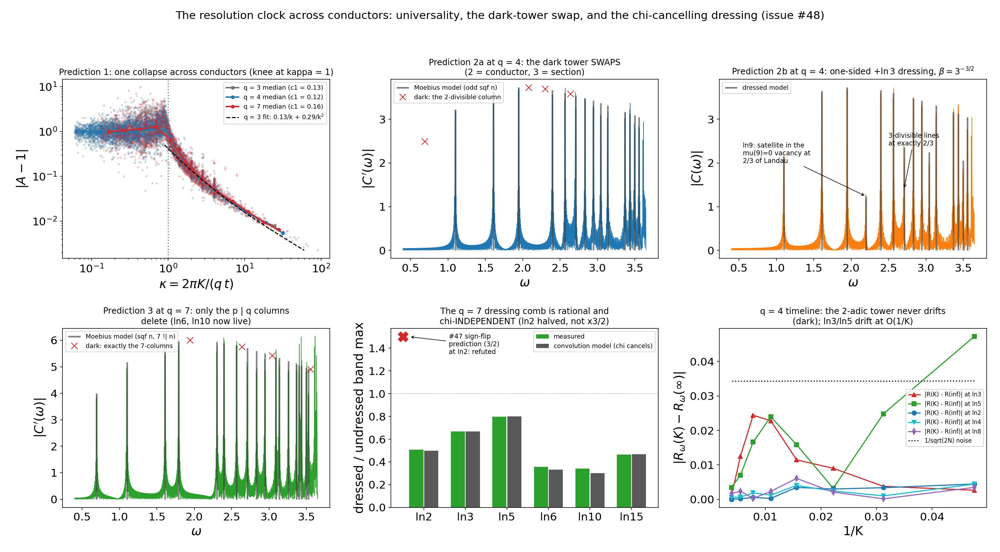

# explorations/ — post-manuscript experimental arcs

This directory holds **experimental work that is deliberately disjoint from the
frozen manuscript arc** (`bridge/` + `paper/` + `RESULTS.md`). Nothing here is
referenced by the paper, `repro.py`, or CI. Tests live in `explorations/tests/`
and are **excluded from the default suite** (`pytest.ini`'s `testpaths = tests`);
run them explicitly:

```
pytest explorations/tests            # fast (~5 s)
pytest explorations/tests -m slow    # + migration regression, bulk zero polish
```

Drivers are local/manual only (issue #37's CI-economy note): run them directly,
e.g. `python explorations/character_bridge.py` (minutes; writes
`explorations/figures/character_bridge.png`),
`python explorations/chi6_two_component.py` (seconds from the cached zero CSV;
`--recompute-zeros` re-runs the ~1–2 min Hardy-Z walk),
`python explorations/zero_birth.py` (~10 min, the λ-flow and census dominate;
writes `explorations/figures/zero_birth.png`), or
`python explorations/conductor_sweep.py` (~20 s from the CSV caches;
`--recompute-sweep --recompute-zeros` rebuilds both in ~3 min), or
`python explorations/arithmetic_clock.py` (~2 min from the caches, mostly the
winding spot-checks — `--skip-certify` for seconds; `--recompute-kwalk --jobs 10`
rebuilds the 400-zero K-walk in ~1 h wall, `--recompute-lamflow` the λ-flow in
~5 h — the warp evaluator's precision inflates with height and its grids
rebuild per height, and the t ≤ 36 box boundary is where the single-seed
secant polish starts losing zeros), or
`python explorations/mobius_dressing.py` (seconds; pure post-processing of the
committed a₁ cache), or
`python explorations/conductor_clock.py` (~2 min from the caches, mostly the
winding spot-checks — `--skip-certify` for seconds; `--recompute-zeros`
rebuilds the two censuses in ~5 min; `--recompute-kwalk --jobs 10` rebuilds
the q = 4 and q = 7 K-walk caches in ~20–30 min wall *each*), or
`python explorations/lambda_census.py` (seconds from the caches;
`--recompute-scan --recompute-flows --jobs 10` rebuilds the certified t ≤ 120
census and its λ-flows, ~1–2 h wall).

If an arc here matures, the intended landing zone is a **second paper or a new
appendix**, never edits to the frozen manuscript.

---

## `character_bridge.py` — character combs: the K-knob on L(s, χ) (issue #37)



The discreteness-restoration knob extended to Dirichlet L-functions through the
(textbook) Hurwitz decomposition, `L(s,χ) = q^{-s} Σ_a χ(a) ζ(s, a/q)`, with the
Hurwitz components carrying the bridge's K-knob: the additive residue-class comb
(closed form via lower-limit incomplete-gamma moments; reduces **exactly** to
`harmonic_bridge.zeta_K` at α = 1) and the warp route (a literal linear
combination of `warp_alpha.warp_complete_alpha` calls). Everything below is
measured by the driver, which self-validates its identities (functional-equation
residuals ~1e-30, including the complex root number for χ₅) before plotting.

**Findings (2026-08-01, first pass):**

1. **The rate law survives with a q-dependent constant.** Component-wise,
   `ζ(s,α) − ζ_comb_K ~ (s/2π²)·α^{−s−1}/K` (the α-generalization of
   `rate_law.rate_comb`; α = 1 recovers it exactly), and the χ-weighted sum gives
   `L − L_comb_K ~ (sq/2π²)·[Σ_a χ(a) a^{−s−1}]/K` — q times a one-period section
   of `L(s+1, χ)`, so the constant grows ~linearly in the modulus. Note the
   constant belongs to the *comb organization*, not the L-function:
   `lfunction_bridge.py`'s carrier comb for the same `L(s,χ₄)` has the plain zeta
   constant `s/2π²`, the residue-class comb has `(4s/2π²)(1−3^{−s−1})`. Both
   measured.
2. **Order from disorder (issue #37, prediction 2).** Each component `ζ(s,a/5)`
   is Davenport–Heilbronn-scattered (generic phase in the Saias–Weingartner
   dichotomy, per `warp_alpha.py`); the χ₅-weighted combination is a primitive
   L-function whose zeros the migration lands on σ = 1/2 at O(1/K). Critical-line
   order materializes only in the arithmetically-weighted superposition. The
   complex character χ₅(2) = i is the repo's first genuinely complex-coefficient
   migration (no conjugate symmetry in t) — same story.
3. **Imprimitive split (prediction 1, structural part).** For
   χ₆ = χ₃ induced mod 6, `L(s,χ₆) = (1+2^{−s})·L(s,χ₃)`: the Euler-factor comb at
   σ = 0, t = (2m+1)π/ln 2 is verified, and the migration splits the ground
   string onto σ = 1/2 ∪ the σ = 0 comb — the η precedent (rigid comb ×
   critical string) at a genuine imprimitive L. The spectral-statistics
   measurement (crystal × GUE superposition instruments) is deferred to a
   sub-issue.
4. **The projector (prediction 3).** With the DC offset (the k = 0 Fourier mode
   of the shifted sawtooth) and the m = 0 completion cell counted as
   *discreteness data* — i.e. inside the knob — every warp component's K = 0
   endpoint is the same `∫₁^∞ x^{−s} dx = 1/(s−1)`, and orthogonality
   (`Σ_a χ(a) = 0`) kills the combination identically: **a non-principal
   L-function is all comb and no continuum**, born from the zero function. Under
   the DC-always-on convention (warp_alpha as built) the K = 0 endpoint is a
   small entire function instead — both endpoints are computed side by side; the
   right normalization for the small-K zero-birth story is deliberately left
   open (sub-issue).
5. **A measured surprise: the ground string's geometry is set by φ(q).** The
   comb-route K = 0 endpoint `E_χ` (an EM-weighted one-period section — the
   K-knob's kinship to the partial-sum literature) has its zeros **exactly on
   σ = 0** for the two-unit moduli q ∈ {3, 4, 6} (verified to ~48 digits: the
   zero condition collapses to `p^{−s} = (qs−(q−2))/(qs+(q−2))`, a Möbius map
   unimodular precisely on the imaginary axis, by the a ↔ q−a unit reflection).
   For φ(q) > 2 (q = 5) the ground zeros scatter. σ = 0 is also exactly where
   the imprimitive Euler combs and the midpoint warp's companion live.

**Honest framing.** Experimental mathematics; no RH/GRH claims. The Hurwitz
decomposition is classical. What the adversarial lit pass (below) did not find a
published analog for is precisely: deforming the *character-weighted
combination* through a *discretization* parameter and *tracking the zero
trajectories* of the combination onto the critical line.

### Lit-pass record (2026-08-01, adversarial search for issue #37)

> **What's known, what has no published analog (L-function fork).** The degree-1
> classification we lean on — every Selberg-class element of degree 1 is ζ(s) or
> a shifted primitive Dirichlet L-function L(s+iθ,χ) — is Kaczorowski–Perelli
> (Acta Math. 182, 1999), conjectured by Conrey–Ghosh (Duke Math. J. 72, 1993),
> who had proved d = 0 forces F = 1 and that no degree lies in (0,1); the
> (0,1)-nonexistence has still-earlier antecedents in Richert (1957) and Bochner
> (1958) for Dirichlet series with functional equations, and Soundararajan
> (2005) gives the simplest proof of the degree-1 case. (For the *extended*
> class S# the degree-1 answer is linear combinations of shifted L's — quote the
> clean statement only for the Selberg class proper.) On the construction
> itself: parameterized approximation families for Dirichlet L-functions do
> exist in print — partial sums of length N (Ledoan–Roy–Zaharescu 2014 for
> cyclotomic Dedekind zetas, i.e. products of all L(s,χ) mod q; Roy–Vatwani,
> Adv. Math. 2019; Dubon 2025 for β = L(s,χ₄)), truncated Euler products (Gonek
> 2012 for ζ, with L-function analogs only sketched), and — closest in spirit
> to our K-knob — the cyclic-graph discretization program of Friedli and
> Karlsson (Friedli 2016; Friedli–Karlsson 2017; Karlsson–Müller 2026
> *preprint*, which approximates L(s,χ) by finite spectral sums on ℤ/nℤ via
> Euler–Maclaurin expansions). But in every one of these, the zero results are
> of a different kind: zero-free regions, zero counts, density of real parts, or
> GRH-equivalences via asymptotic functional equations of the approximants.
> Nakamura's quadrilateral zeta (J. Number Theory 233, 2022) deforms a
> symmetrized Hurwitz-plus-periodic combination through the shift parameter a
> with zero counts on the line, and Garunkštis–Steuding (2007) track individual
> Hurwitz zeros through the shift — yet we found no published work that deforms
> a *character-weighted combination* of Hurwitz zetas through a *discretization*
> parameter and *tracks the zero trajectories* of the combination onto the
> critical line. As always with a negative claim, this is "not found under
> adversarial search" (arXiv, journals, citation-chasing; MathSciNet/zbMATH not
> directly searchable), not "provably absent" — and the 2026 Karlsson–Müller
> preprint shows this exact neighborhood is active, so any write-up must cite it
> and distinguish carefully.

Load-bearing BibTeX for this arc is kept in `explorations/references-37.bib`.

### Deferred (sub-issues of #37)

- ~~Spectral statistics for imprimitive L~~ — done in `chi6_two_component.py`
  (issue #38; section below).
- ~~Normalized zero-birth from the identically-zero endpoint~~ — done in
  `zero_birth.py` (issue #39; section below).
- ~~Rate-vs-conductor sweep~~ — done in `conductor_sweep.py` (issue #40;
  section below).

---

## `zero_birth.py` — zero birth from the identically-zero endpoint (issue #39)



The deep half of #37's prediction 3. `character_bridge.py` left it open: under the
DC-in-knob convention a non-principal `L(s,χ)` is born from the **zero function**
(the projector), so "where are the zeros born?" needs a normalization that gives
the K → 0 limit of the *normalized* family a well-defined zero set. This module
answers issue #39's three questions, with the #38-session carryover notes
(bookkeeping via a box census; the χ₆ lock question) folded in.

**Findings (2026-08-01/02):**

1. **The normalization question has a closed-form answer (Q1).** For K ≥ 1 the
   DC-in-knob and DC-always-on families *coincide* — the conventions only disagree
   about the K = 0 object — so the raw K ≥ 1 family is convention-free and scalar
   normalizers move no zeros. The right formalization of "K → 0" is a knob
   **amplitude** λ scaling the entire discreteness datum (DC offset, completion
   cell, harmonics) at fixed K; then `F_K^λ/λ → D(s) = Σₐχ(a)a^{−s} + q^{−s}L(0,χ)`
   linearly in λ (measured ratio 10.0 per λ-decade) and **independently of K** —
   orthogonality kills the α-independent first-order content (harmonics and the
   −1/2), leaving the completion cells + the DC ramp. Every K-family sprouts from
   one seed set (Hurwitz's zero-convergence theorem makes "normalized zero set"
   honest), and the λ-flow measures it: K = 1 and K = 3 zeros land on the *same*
   seeds. The amplitude embedding is canonical, not just convenient: the rival
   (morph the completion cell's *location*) has tangent `(1+s)q^{−s}L(0,χ)` —
   identically zero for even χ, string-free for odd — a degenerate seed either way.
2. **Seed geometry: a wobbling σ = 0 comb, plus the conductor's own string.** For
   φ(q) = 2, `D = 1 − p^{−s} + q^{−s}L₀` perturbs the exact σ = 0 comb
   `t = 2πm/ln p`: seeds sit on constant-radius circles `L₀/ln p` (≈ 0.48, 0.46
   for q = 3, 4) around the teeth with equidistributing phases (first-order
   predictions land within ~0.1–0.35). And because D's frequency set is
   {ln a} ∪ {ln q}, its mean-motion density `ln q/2π` exceeds the comb's
   `ln p/2π`: the surplus `ln(q/p)/2π` is a **sparse far-left string where the
   conductor term q^{−s}L₀ balances the p^{−s} term** — predicted
   σ\* = ln L₀/ln(q/p), spacing 2π/ln(q/p): q = 3 → (−2.71, 15.5), measured
   −2.87+15.21i, −2.98+31.11i; q = 4 → (−2.41, 21.8), measured −2.38+21.59i.
   Odd χ only (even χ have L₀ = 0). Character zeros are seeded in a ~0.45-radius
   annulus around **σ = 0** (+ the conductor string) where ζ's comb zeros are born
   near **σ ≈ 1–1.35** from the pole side — #37 prediction 3's "qualitatively
   different birth story", now a measured left-edge/right-edge dichotomy.
3. **The census: geometric birth is *instant* — a λ-phenomenon, not a
   K-phenomenon (Q2).** The argument-principle box census (adaptive phase-winding;
   entire-L counting with **no +1**, the #38 convention) reads, for χ₃ in the
   standard box (t < 30.29): ground 3 → **N_K = 8 = target at every K ≥ 1, both
   routes**. The first harmonic already carries the full Riemann–von Mangoldt
   count (its incomplete-gamma moments are not almost-periodic, so the
   bounded-density ground argument stops applying at K = 1), and the K-knob
   thereafter is pure O(1/K) displacement — no births. The ln T surplus separating
   the bounded-density ground (`ln(q−1)/2π`) from the RvM target is created
   entirely inside K = 1, resolvable only by the amplitude knob — which is what
   makes the λ-flow *the* birth instrument. ζ through the same instrument: 4 → 3
   (one transient extra zero dies at K = 2, the count is otherwise instant too).
   The λ-flow's Hurwitz bookkeeping closes the loop: 8 raw K = 1 zeros vs ~5 box
   seeds — 5 flows land on seeds (including one raw zero at σ ≈ 0.08 flowing
   *left* onto the conductor seed at −2.87+15.21i), and all four surplus zeros
   exit the compact **leftward** (last tracked at σ ∈ [−3.4, −1.5] at λ = 0.012):
   the un-seeded excess flees toward σ = −∞ past the conductor region.
4. **The displacement law survives χ-weighting (Q2).** At a simple zero ρ,
   `s_K − ρ ~ a₁/K` with `a₁ = (sq/2π²)B(ρ+1)/L′(ρ)` (the `rate_law.disp_coeff`
   machinery with the χ comb constant as Δ₁): worst |K·(s_K−ρ) − a₁|/|a₁| = 3% at
   K = 45 across χ₃ and the complex χ₅.
5. **Ground-string geometry, certified and unified (Q3).** For q ∈ {3, 4, 6} the
   E_χ zero condition on σ = 0 is one real phase equation
   `t ln p + π − 2 arctan(qt/(q−2)) = 2πm` (`axis_roots`), and the argument
   principle certifies the *full* box zero set is on the axis: box count == axis
   count (4/7/10) over |σ| ≤ 2, t ≤ 40. For φ(q) > 2 the ground zeros scatter
   (max|σ| 0.68–2.6, density ≈ ln(q−1)/2π) but stay on the **section skeleton**:
   E_χ → B/2 at large t, and the measured distance to the nearest B-zero decays
   ~1/t (median t·dist ≈ 0.7–1.0 across q = 3,4,5,7,9; one outlier max for
   χ₇^(3) where the matching hits the σ-window edge). The unifying object is the
   one-period section `B(s) = Σχ(a)a^{−s}`: the comb ground is
   `B(s−1)/(q(s−1)) + B(s)/2`, the warp seed is `B(s) + q^{−s}L(0,χ)`, the rate
   constant is `(sq/2π²)B(s+1)` — ground-and-rate data = the section at three
   consecutive arguments, with the comb ground *collapsing onto* B's zero set and
   the warp seeds *orbiting* it at constant radius.
6. **χ₆: the anti-phase lock develops — it is not inherited (the #38 carryover
   question).** The comb-bound ground zeros sit at offsets −0.85, +1.97, +0.73
   from their final teeth (vs the 3.90 ground spacing): the lock #38 measured on
   the finished spectrum is built *during* migration, not present at K = 0. The
   walk also witnesses finding 3's arithmetic: 7 targets below t ≈ 24 reach only
   6 axis roots (two walks double-land on t = 15.563) — the bounded-density
   ground under-supplies the union by the born surplus, so the backward
   continuation cannot be injective (η's ground↔target bijection has no χ₆
   analog).

**Honest framing.** Experimental mathematics; no RH/GRH claims. The ingredients
are classical — `L(0,χ) = −(1/q)Σχ(a)a`, Hurwitz's theorem, mean-motion /
almost-periodic zero counts for exponential polynomials (Jessen–Tornehave),
argument-principle counting. What has no published analog we know of (per the #37
adversarial lit pass) is the finite-K construction itself: the identically-zero
endpoint's amplitude-tangent seed object, its K-independence, the measured
instant-census / λ-birth split, and the conductor seed string.

### Deferred from #39 (follow-up)

- ~~The arithmetic birth clock~~ — done in `arithmetic_clock.py` (issue #44;
  section below).

---

## `chi6_two_component.py` — the χ₆ zero set as crystal × GUE (issue #38)



The spectral half of #37's prediction 1: `eta_two_component.py`'s crystal × GUE
superposition analysis generalized to the imprimitive zero set
`L(s,χ₆) = (1+2^{−s})·L(s,χ₃)` — the σ = 0 Euler comb `t = (2m+1)π/ln 2` (η's
period, **half-period offset**) superposed with the σ = 1/2 `L(s,χ₃)` zeros. The
zero sample is computed blind in-module (a Hardy-Z sign walk: ε(χ₃) = +1 makes
`Z₃(t) = e^{iθ₃(t)}L(½+it,χ₃)` real; ~400 zeros to t ≈ 550, census within
|S(T)|-noise of θ₃/π **with no +1** — L is entire, so ζ's pole term is absent
from the counting formula; cached in `data/chi3_zeros.csv`, spot-verified by
2-D findroot on L itself to ~1e-13).

**Findings (2026-08-01):**

1. **η's p=2 lock survives, χ-twisted — two differences that cancel.** The comb
   is offset half a period (teeth where cos(t ln 2) = −1), *and* χ₃(2) = −1
   flips the explicit-formula p=2 coefficient, so the measured resonance
   `⟨cos(mγ ln 2)⟩` **alternates in m** (+0.105, −0.076, +0.057, −0.038 vs
   predicted +0.107, −0.076, +0.054, −0.038): the L-zero density peaks where
   cos(t ln 2) = +1, and the teeth again sit at the **partner density minima**.
   The comb's own resonance is (−1)^m exactly (odd multiples of π/ln 2 ↔ the
   alternating χ₃(2^k) sums that imprimitivity deleted from the prime side):
   always opposite the zeros' — the crystalline component *is* the missing
   Euler factor, seen as a spectrum.
2. **The conductor prime goes dark.** χ₃(3) = 0 kills the explicit-formula
   terms at log 3 and log 9: measured |⟨cos⟩| ≤ 0.009 (noise) where ζ resonates
   at −0.13. The character's arithmetic read directly off the zeros — a
   falsifiable difference from η with a clean null result.
3. **The lock at two-point level: the physical offset minimizes Σ²(L).** At
   N ≈ 400 the number variance sits in Berry's saturated regime (χ₃-alone flat
   ≈ 0.27, matching a matched-size ζ sample — GUE class at matched N). The
   decisive instrument is the **comb-offset ensemble**: the union with the
   *physical* comb tracks the zeros-alone curve (the comb adds ~no count
   variance) and sits at the extreme low tail of the dephased ensemble
   (essentially 0 of 32 random-offset draws fall below it, at every L), while
   the anti-locked comb (δ = 0) and the naive independent GUE(f_L·L)+picket
   model sit well above. The crystal fills the L-zero density minima — LENS 3's
   one-point lock re-measured as a **negative two-point cross-covariance**,
   consistent with the union being the *single* zero set of L(s,χ₆), whose
   explicit formula has no p=2 terms for an independent-superposition model to
   reproduce. Same verdict on the cross-check side: for χ₀ mod 2 (comb at
   2πk/ln 2 ⊕ ζ zeros) the physical offset δ = 0 is *its* variance minimizer.
4. **Form factor: the Bragg excess is cancelled.** Band-averaged K(τ) over the
   smeared m = 1 comb band: zeros alone 0.139, union with dephased comb 0.252
   (the expected crystalline excess), union with the physical comb 0.122 —
   destructive interference, the Fourier face of finding 3. The χ₃ zeros alone
   ride the GUE ramp (small-τ slope ≈ 0.7–0.9 by windowing); spacings are
   Wigner-GUE (KS 0.08 vs Poisson 0.34) — "GUE at ½" *measured* for χ₃ rather
   than assumed — and the union's p(s) matches the independent superposition:
   the lock is invisible at spacing level, as in η.
5. **Degenerate cross-check.** χ₀ mod 2 = (1−2^{−s})ζ through the same
   pipeline reproduces `eta_two_component.py`'s numbers verbatim (−0.098 at
   m = 1, constant sign where χ₆ alternates).

**Honest framing.** Experimental mathematics; no RH/GRH claims. The measured
objects (explicit-formula resonances, Berry saturation, superposed-spectra
statistics) are classical individually; what is new here is the *measurement*
of the imprimitive comb ⊎ GUE union — the χ-twisted lock, the dark conductor,
and the offset-ensemble Σ²/form-factor cancellation. Sample-size caveat: the
growing-regime Σ² reading (η's GUE-log + picket) needs a much longer zero
sample and stays deferred.

---

## `conductor_sweep.py` — rate vs conductor: the comb constant swept over q ≤ 50 (issue #40)



The systematic half of #37's prediction-2 rate question. `character_bridge.py`
measured `L − L_comb_K ~ (sq/2π²)B(s+1,χ)/K` (with `B(s) = Σχ(a)a^{−s}` the
one-period section) at q = 3..6; this module measures it across **every
primitive χ mod q ≤ 50** — 470 characters, 36 moduli, both parities, real and
complex, cyclic and non-cyclic — plus the zero-displacement statistics and the
instant-census re-ask. The build item that unlocks it:
`character_bridge.characters_any(q)`, a CRT-product constructor over the cyclic
components of `(Z/q)^*` (with `{±1}×⟨5⟩` at `2^e, e ≥ 3`), exact unit-group
exponents as before; validated against the old constructor on cyclic moduli
(identical character sets), exact orthogonality, and primitive counts = (μ∗φ)(q)
for all q ≤ 50.

**Findings (2026-08-02):**

1. **The knob's natural clock is K/q.** The comb's error series at fixed s runs
   in q/K, not 1/K: `K(L − L_comb_K) = Δ₁ + c₁/K + c₂/K²` with `c₁/Δ₁ = O(1)`
   roughly q-independent and `c₂/Δ₁ ≈ 0.50·q²` (median over the sweep 0.50,
   full range 0.36–0.63). Interpretation: the k-th sawtooth harmonic resolves
   the a/q residue lattice only once k ~ q — convergence progress is harmonics
   *per residue class*. Practical corollaries: fixed-K measurements degrade
   linearly in q (K = 160 gives 0.3% at q ≤ 6 but ~4.5% at q ≈ 48); 2-point
   Richardson in 1/K is *worse* than the raw value at large q (the 1/K² term
   flips in with doubled sign); conductor-scaled checkpoints K = (5q, 7q, 10q)
   + 3-point Richardson eliminate both layers and land **q-uniform** residuals.
2. **The amplitude law, confirmed conductor by conductor.** Measured
   `lim K(L − L_comb_K)` vs `(sq/2π²)B(s+1,χ)` at s₀ = 1.3+7i: median residual
   6.4e-4, worst 8.5e-4 over all 470 characters. The group mean over the full
   character table mod q is *exact* by orthogonality (only a = 1 survives):
   `⟨rate⟩_χ = q·s/2π²` — the linear-in-q spine, verified to working precision;
   the section factor B(s+1) is the O(1) per-χ fluctuation around it.
3. **The section factor carries the surviving-prime fingerprint.** |B(s₀+1) − 1|
   is set by the smallest prime *not* dividing q: measured tiers p\* = 2 (odd q,
   421 χ): mean 0.215 vs 2^{−2.3} = 0.203; p\* = 3 (38 χ): 0.081 vs 0.080;
   p\* = 5 (q ≡ 0 mod 12, 11 χ): 0.026 vs 0.025. The ramified p | q columns are
   deleted from the section exactly as they vanish from the explicit formula's
   prime side (#38's dark-conductor null) — the same arithmetic read through the
   approximation rate. This is the concrete connection to the
   weil-positivity-lab conductor thread (its #22/#31): in a q-sweep the explicit
   formula loses exactly the p | q prime columns, and the comb constant's
   section factor is the rate-law face of that same dropout.
4. **Zero displacement: linear amplitude, density tempering.** Bulk critical-line
   samples via the #38 Hardy-Z walk generalized to every real primitive χ
   (ε = +1 by Gauss, verified per conductor): 332 zeros across q = 3..43, each
   census within |S(T)| noise of θ_χ/π (no +1). At each zero,
   `|a₁| = (q|ρ|/2π²)|B(ρ+1)|/|L′(ρ)|`: median |L′| climbs ×1.7 (tracking the
   ×1.6 growth of the local density `ln(qt/2π)/2π`) while the density-rescaled
   `|L′|/ρ_dens` stays q-flat at 5.4 ± 0.5 — conductor-aspect GUE-flavored
   universality, observed not assumed. Net: median |a₁| grows ×6.9 from q = 3
   to 43, riding the tempered `q/ln(qt̄)` curve and cleanly excluding pure-linear
   ×14.3. Zero condensation is slower at larger conductor by the linear
   amplitude only; in resolution units (fixed K/q) it is asymptotically
   conductor-free up to the section factor and L′ fluctuations. Spot-certified
   end-to-end at the *non-cyclic* moduli (χ₈, χ₁₅: measured K = 45 comb roots
   vs `a₁ = rate_comb_chi(ρ)/L′(ρ)`, rel 0.02–0.03).
5. **The instant census is generic.** The #39 box census re-asked at q = 5, 8,
   12, 15 (both parities, non-cyclic included): N_K = target = 11, 13, 15, 16
   at *every* K ∈ {1, 2, 3} — without even ζ's one transient extra zero. The
   full Riemann–von Mangoldt count is present at K = 1 at every conductor
   tried; the K-knob is pure displacement thereafter.
6. **Ride-alongs (the #43 closed forms across q).** L(0,χ) for the odd walk
   family lands on the classical class-number values (1/3, 1/2, 1, 1, 2, 3, 3,
   1 at q = 3, 4, 7, 11, 15, 23, 31, 43); the conductor-string location
   `ln L₀/ln(q/(q−1))` parks at σ\* = 0 exactly when L₀ = 1 and jumps far right
   for L₀ ≥ 2, while its spacing `2π/ln(q/(q−1)) ≈ 2πq` thins the string out
   ~1/q — the conductor's own seed signature fades at large conductor.

**Honest framing.** Experimental mathematics; no RH/GRH claims. The CRT
construction, Gauss's ε = +1, and the smooth counting function are classical;
the q-aspect growth of L′ moments is conjectural territory
(Hughes–Keating–O'Connell-flavored) that we *measure*, not derive. What has no
published analog we know of (per the #37 adversarial lit pass) is the finite-K
rate object itself: the conductor-swept measurement of the comb constant, the
q/K resolution clock, and the conductor statistics of a₁.

Data caches: `data/conductor_rate_sweep.csv` (per-χ measured/predicted constant,
residuals, section factor), `data/conductor_walk_a1.csv` (per-zero γ, |L′|, |B|,
|a₁|). Driver ~20 s from the caches, ~3 min fresh.

---

## `arithmetic_clock.py` — the arithmetic birth clock: prime resonance along the K-family (issue #44)



The deferred compute half of #39 (the #38-session carryover, split out of PR
#43 for cost). #43 timed **geometric birth** — the census is complete at K = 1,
and the knob thereafter is pure O(1/K) displacement — so the sharpened question
is how the **arithmetic** (the χ-twisted explicit-formula prime resonance #38
measured on the finished zero set) converges along that displacement field. The
heavy step walks all 400 cached χ₃ critical zeros down a K schedule by 2-D
Muller solves of `L_comb_K` (no Hardy-Z at finite K — the family has no
functional equation), predictor-seeded by the displacement field with adaptive
substepping, per-K collision repair (censuses of 398–400/400 at every reported
K; argument-principle spot-certification exact), plus a λ-flow
re-instrumentation of the #43 birth flow. Caches in
`data/arithmetic_clock_*.csv`; the default driver replots in ~2 min.

**Findings (2026-08-02):**

1. **Arithmetic birth is also instant — and refinement is O(1/K) with a
   computable constant (Q1).** The full-census p = 2 resonance
   `⟨cos(γ_K ln 2)⟩` is already +0.109 at K = 16 (deep pre-asymptotic, κ < 0.5
   for most of the sample) against +0.1045 at K = ∞: every live mode has the
   right sign and magnitude at every K measured — the knob *refines* the
   arithmetic, it never creates it. Quantitatively, on the locked sub-census
   (t ≤ 100, K ∈ {96, 136, 192}), the fit `K·ΔR_ω = C + c′/K` lands on the
   predicted first-order constant `C_ω = −ω⟨sin(γω)·Im a₁⟩` at 0.5 % for
   ω = ln 2 (fit +0.06832 vs +0.06869), 1.3 % at ln 8, 3–5 % at ln 4, ln 16 —
   the issue's prediction 1, verified with the `a₁ = (sq/2π²)B(ρ+1)/L′(ρ)`
   field of #43.
2. **The resolution clock is κ = 2πK/(qt) — #40's conductor clock with height
   in the conductor's role (Q2, sharpened).** The per-zero complex
   amplification `A = K(s_K − ρ)/a₁` collapses across the whole (t, K) grid
   onto one curve in κ: median |A−1| ≈ 1 for κ < 1 (zeros displaced O(a₁) but
   *not* by a₁/K), a knee at the band edge κ ≈ 1, then an asymptotic wing
   (fit 0.13/κ + 0.29/κ² past κ = 2). Mechanism: the a = 1/q Hurwitz moment
   keeps interior stationary
   phase (y\* = t/2πk ≥ 1/q) up to k ~ qt/2π, so the harmonics resolve the
   height-t oscillation only past that Nyquist-like edge. #40's fixed-s sweep
   sat at t ≈ 2π, exactly where q/K and qt/2πK coincide — its "measure at
   K ∝ q" is "measure at fixed κ". The asymptotic regime is a moving front
   t_front ≈ 2πK/q, *inside* the sample at K = 192 (t_front ≈ 402): behind it
   the displacement law holds per-zero; ahead of it only the ensemble
   statistics do. Walk integrity tracks the same clock: collided walks fall
   39 → 1 from K = 16 → 192 (160 of 167 rescued by local rescans).
3. **The conductor prime is dark at every K (Q2 answered).** |R(K)| ≤ 0.011 at
   ln 3 and ≤ 0.015 at ln 9 at *every* K from 16 up (vs +0.105..+0.118 at
   ln 2, sample noise 0.035): χ₃(3) = 0 needs no K → ∞ limit — the null is
   present along the entire knob, pre-asymptotic zone included.
4. **The convergence constant is itself an explicit-formula object — with a
   2-adic sideband anomaly.** Swept in the test frequency, C(ω) is a line
   spectrum: window-limited lines (lobe width ~π/T ≈ 0.006) at the odd prime
   frequencies ln 5, ln 7, ln 11, ln 13 whose band maxima fit ONE common scale
   × Λ(p)/√p (the χ-twisted Landau-formula amplitude) with 2–4 % residuals;
   ln 4 lands on the same scale to 0.1 % (measured 1.388 vs 1.386). The two
   departures are structured: the ln 2 line is *halved* (0.99 vs 1.96) and
   ln 8 nearly extinguished (0.12 vs 0.98) — consistent with the section
   factor `B(ρ+1) = 1 − 2^{−3/2}e^{−iγ ln 2}` inside a₁ dressing every line
   with ±ln 2 sidebands (the missing-Euler-factor crystal, now read in the
   convergence constants); and the conductor tower is dark — ln 3 (0.056) and
   ln 9 (0.102) sit inside the control floor (0.03–0.26 over six off-prime
   bands). The displacement field's arithmetic *is* the explicit formula's
   surviving-prime set, dropout included.
5. **The λ-handoff is fate-selection, not phase migration (Q3).** The raw
   K = 1 warp census (t ≤ 36.2 box, winding-certified count 11 = 10 scanned +
   1 winding-guided rescue of a narrow-basin zero at 0.18 + 30.88i) flows to
   *exactly* the box's 6 seeds — the four main teeth m = 1..4 and **both**
   conductor-string seeds (the rescued zero is the m = 2 conductor capture,
   landing on −2.98 + 31.11i) — while the 5 surplus flows are expelled
   leftward: Hurwitz bookkeeping 11 = 6 + 5 on the nose. The 2-adic order
   develops by *selection*: the seed-fated cohort is already phased at λ = 1
   (`⟨cos(γ ln 2)⟩` ≈ +0.46..+0.48, flat along the entire flow) while the
   full tracked ensemble sits near +0.24 until the surplus leaves (+0.42 at
   λ = 0, census 11 → 6). GUE-flavored phase disorder never "hands off" — it
   is deported. The λ = 0 value is pure seed geometry: main teeth
   cos(γ ln 2) ≈ +0.94..+0.99 (mean +0.97, the L₀/ln p wobble), conductor
   seeds anti-phased (−0.44, −0.91), mean 0.421 = measured to 3 digits. At
   N = 6 *every* frequency reads deterministic geometry (ln 3 lands at −0.605
   by the same arithmetic) — the λ-side conductor column is geometry, not
   statistics; no prime-3 claim.

**Honest framing.** Experimental mathematics; no RH/GRH claims. First-order
zero perturbation, stationary phase, and Landau's prime-power formula (here
χ-twisted) are classical; the K = ∞ resonance values are #38's. What has no
published analog we know of (per the #37 adversarial lit pass) is the finite-K
measurement itself: the resonance timeline along a discreteness knob, the
qt/2πK resolution clock unifying #40's conductor sweep with the height axis,
the every-K conductor null, and the a₁-weighted Landau line spectrum with its
2-adic sideband anomaly. Sample-size caveats: N = 400 (noise 0.035 per mode);
the locked sub-census is N = 45.

Data caches: `data/arithmetic_clock_a1.csv` (per-zero a₁),
`data/arithmetic_clock_kwalk.csv` (the walked census: n, γ, K, s_K, status),
`data/arithmetic_clock_lamraw.csv` + `data/arithmetic_clock_lamflow.csv` (the
K = 1 raw zeros and their λ-trajectories).

Follow-ups filed from this arc: the C(ω) sideband anomaly is **resolved** in
`mobius_dressing.py` (issue #47; section below); the conductor sweep of the
resolution clock (#48) and the λ-census at scale (#49) remain open.

---

## `mobius_dressing.py` — the C(ω) spectrum is Möbius, and the section dresses it (issue #47)



The near-free follow-up split out of #44: is the 2-adic anomaly in the C(ω)
line spectrum (ln 2 halved, ln 4 Landau-perfect, ln 8 extinguished) the section
factor `B(ρ+1) = 1 − 2^{−3/2}e^{−iγ ln 2}` inside a₁ dressing the lines? Pure
post-processing of the committed a₁ cache — seconds, no zero computation.
Answer: **yes — and dividing B out does not restore a Landau spectrum; it
reveals the spectrum was never Landau.**

**Findings (2026-08-02):**

1. **The undressed spectrum is Möbius, not Landau.** With `a₁′ = a₁/B(ρ+1)`
   (B closed-form per γ) the weight is ∝ `s/L′(ρ)` — the Perron kernel of
   `1/L = Σ μ(n)χ(n)n^{−s}`, i.e. the explicit formula for the χ-twisted
   Mertens function `M_χ(x) = Σ_ρ x^ρ/(ρL′(ρ))` (Titchmarsh §14.27's
   L-analog; Gonek/Ng's discrete moments `Σ x^ρ/ζ′(ρ)`). Measured: **all
   fourteen squarefree bands** n = 2, 5, 7, 10, 11, 13, 14, 17, 19, 22, 23,
   26, 34, 35 sit at 0.96–1.16 of `scale·ln n·|μ(n)χ₃(n)|/√n`, while the
   prime-power bands ln 4, ln 8, ln 16 are **dark** (0.06/0.13/0.32 of their
   Landau references) and the conductor bands stay at the floor. On primes
   `Λ(p) = ln p·|μ(p)|` — the two spectra *coincide on every prime line*, so
   #44's odd-prime anchor fit could not discriminate; the discriminators are
   exactly the bands #44 flagged as anomalous, plus its stray ln 10 peak
   (a genuine μ-line: Λ(10) = 0 but μ(10)χ₃(10) = +1).
2. **The dressing law is a one-sided +ln 2 shift with coefficient
   β = 2^{−3/2} — and an exact-½ suppression.** `a₁ = B·a₁′` convolves the
   Möbius line measure with `δ − β·δ_{+ln 2}` (upward only: the measure's
   line content sits in the conjugate channel, and nothing appears at
   ln p − ln 2 — measured ≤ the control floor in both spectra). On the comb
   this halves **every even squarefree line exactly**:
   `|μ(2)χ₃(2)/√2 − β|/(1/√2) = 1/2`, measured 0.50–0.54 across
   n = 2, 10, 14, 22, 26, 34 — while every odd line is untouched (0.92–1.02),
   including the 2-free composite ln 35.
3. **#44's "ln 4 on the Landau scale to 0.1 %" is unmasked as a p = 2
   algebraic identity, not evidence of a Λ-spectrum.** The dressed ln 4 line
   is the ln 2 line's satellite landing in the μ(4) = 0 *vacancy*, amplitude
   `scale·ln 4·β/√2` — which equals the Landau reference `scale·Λ(4)/2`
   **identically** (satellite/Landau = 2/p, = 1 only at p = 2). Measured at
   0.993 of the closed form. ln 8 is the satellite of an *empty* parent
   (μ(4) = 0), and the cascade stops after one step (B has a single
   sideband): ln 8, ln 16 dark in both spectra, as measured.
4. **What the phases certify.** The ½-law and the vacancy amplitude are
   *relative*-phase measurements (parent vs satellite, forced real-positive
   by the data). The *absolute* sign of each line against μ(n)χ₃(n) is not
   resolved at this window: T ≈ 550 makes a sub-resolution band-center offset
   rotate the quadrature by ~1 rad, and measured sin-quadrature signs agree
   with μχ only 7/13 — consistent with scrambling, reported as a null.
5. **Falsifiable predictions logged for #48 (the conductor sweep).** For a
   φ(q) = 2 modulus with section prime p_B = q − 1: dressing frequency
   ln p_B, β = p_B^{−3/2}, even-line suppression
   `|μ(p_B)χ(p_B) − 1/p_B|` (an *enhancement* 1 + 1/p_B where
   μ(p_B)χ(p_B) = −1), and the vacancy satellite at ln p_B² sits at 2/p_B of
   the Landau reference — Landau-exact only at p_B = 2. At q = 4 (p_B = 3):
   ln 3m lines suppressed to 2/3, ln 9 satellite at 2/3 of Landau.

The driver self-validates 40 checks (V1 Möbius amplitudes, V2 prime-power
vacancies, V3 the ½-law, V4 odd-line invariance, V5 the ln 4 closed form,
V6 one-sidedness, V7 the conductor floor) — 40/40 on the committed cache.

> **#48 postscript** (`conductor_clock.py`): the q-general dressing closes
> rationally as a divisor convolution, and the χ factor *cancels* — the
> sign-flip prediction in finding 5 (an enhancement 1 + 1/p where
> μ(p)χ(p) = −1) is **refuted**, by the algebra and by the q = 7
> measurement (ln 2 dressed/undressed = 0.51 at χ₇(2) = +1, not 3/2).

**Honest framing.** Experimental mathematics; no RH/GRH claims. The
classical baselines, all cited in `references-37.bib`: Landau 1912 +
Gonek 1993 (*Contemp. Math.* 143 — the uniform version) for the unweighted
Λ-line spectrum, with the χ-twist published as Banks arXiv:2302.07073
Thm 1.2 (also Fujii 1989/90); Titchmarsh Thm 14.27 (with Odlyzko–te Riele
1985's numerical tradition) for the x-domain `M(x) = Σ_ρ x^ρ/(ρζ′(ρ))`
formula our weight is the kernel of; Gonek 1989 / Hughes–Keating–O'Connell
2000 / Milinovich–Ng 2012 for the unweighted negative discrete moments, with
the Dirichlet version `Σ|L′(ρ,χ)|^{−2}` brand-new (Pearce-Crump,
arXiv:2606.25094, June 2026); Conrey–Ghosh–Gonek 1998 for
Dirichlet-polynomial-twisted discrete moments (the nearest machinery to the
section dressing). The adversarial pass (2026-08-02, sub-agent, verdicts
below) found **no published analog** of (a) the μ(n)-line reading of a
1/L′-weighted zero sum as a measured spectrum, (b) its χ-twist, or (c) the
section-dressing law — the nearest classical μ-from-zeros statement is the
**Linnik–Sprindžuk theorem** (Sprindžuk 1975; Kaczorowski–Perelli 2008),
which reads μ(k)/φ(k) off an *unweighted* zero-sum limit at a rational
twist: no 1/L′ weight, a parameter limit rather than a frequency spectrum,
and μ entering through Ramanujan-sum coefficients rather than per-line
amplitudes — cite and distinguish in any write-up. Citation corrections
logged from the pass: Gonek 1993 is *Contemp. Math.* 143, 395–413 (a common
J.-Number-Theory miscitation), and Ng 2004's title begins "The distribution
of the summatory function…".

---

## `lambda_census.py` — the λ-census at scale: the seed-fated fraction law (issue #49)



The heaviest of the #44 follow-ups (split out of PR #46), deferred for compute
AND a machinery build. #44's λ-side verdict at t ≤ 36.2 (N = 11 flows → 6
seeds) was **fate-selection** — the seed-fated cohort is already 2-adically
phased at λ = 1 — but with 6 seeds every λ = 0 instrument reads deterministic
geometry; the statistical questions needed the t ≤ 120 box (N = 59 flows,
21 seeds).

**The machinery** (the two #44 blockers, plus three more the census forced —
details in the module docstring):

1. **The certified Muller scan.** `find_zeros_muller` (Muller local-triple
   polish + escape clamp, replacing `warp_alpha.find_zeros`' stall-prone
   single-seed secant) runs per t-window and is **certified by the argument
   principle** (`certify_window`; deficits → refined rescans → the every-node
   `rescue_deficits` hunt). Validation: the t ≤ 36.2 box reproduces the
   committed 11-zero census exactly, including both zeros the #44 scan needed
   help with. The final t ≤ 120 run certifies **all 15 windows with zero
   refinement rounds**.
2. **dps-bucketed moment grids** (`zero_birth._bucket_dps`): the λ-evaluator's
   grids keyed on exact working precision and rebuilt at every new height;
   bucketing (steps of 5, evaluated at the bucket ceiling, moment headroom)
   makes one grid serve an ~11-unit t window.
3. **The ambient-18 error lobes** (`band_dps`): the warp evaluator's
   |Im s|-guard ramp was tuned at the manuscript arc's ambient dps 30; at the
   census's lean ambient 18, measured |F| errors reach 2e-2 in jagged lobes
   (t ≈ 40–77 and 84–89) while other heights sit at 1e-14. All census work
   above t = 38 runs at ambient 24 (≤ 1e-8 everywhere probed).
4. **Set-integrity repair** (`repair_flows`): trajectory basin hops (the
   default jump gate exceeds the zero spacing above t ~ 90) produced double
   landings on 12 of 21 seeds. The #44 jump-gate policy (0.6× local spacing)
   plus argument-principle repair (one flow per zero, one landing per simple
   seed; merge losers re-solved locally, double landings adjudicated by the
   quadratic λ → 0 extrapolant) brings residual collisions to **zero**.
5. **Tail adjudication** (`resolve_tails`): flows unresolved at the schedule
   floor extend to λ = 0.002 at +4 digits (G = F/λ amplifies the evaluator
   floor), where capture and flight visibly separate.

With all five, the full pipeline (certified scan + seed set + 59 flows +
repair + instruments) runs in **~12 minutes at --jobs 10** — the issue had
budgeted an overnight run.

**Findings (2026-08-03):**

1. **The census is exact bookkeeping.** 59 zeros certified to t = 120.3
   (winding = scan in every window; RvM smooth count 58.7); 21 seeds
   certified (13 main-comb + 8 conductor-string; mean-motion ln q/2π × T
   = 20.7). The flow decomposition: 19 seed captures + 40 expulsions, 39 of
   40 expelled flows last tracked at σ < −0.5 fleeing left.
2. **The seed-fated fraction follows the parameter-free law.** Whole box:
   19/59 = 0.322 vs the integrated law ln q/ln(qt/2π) = 0.352 — within 0.5σ
   (binomial noise 0.062) — and the per-window curve falls with height as the
   law predicts (1.000 → ~0.2–0.3 across 15 windows). The measurement
   convention is conservative: two seats contested at λ = 0 by two flows each
   were adjudicated to one owner, the loser counted not-seed-fated, and two
   seeds go unclaimed — so 0.322 is a floor, with the law's 0.352 inside the
   convention band. #44's single data point (6/11 = 0.545 vs 0.546) is the
   curve's first point.
3. **Fate is statistically readable at birth (the #44 question, answered at
   scale).** The seed-fated cohort's ⟨cos(γ ln 2)⟩ = +0.612 ± 0.133 at λ = 1
   vs −0.070 ± 0.104 for the expelled — a ~4σ cohort separation present at
   birth and **flat along the entire flow** (0.61–0.65 at every λ), while the
   expelled cohort hovers at noise. A single cos(γ ln 2) threshold reads a
   flow's fate at 0.83 accuracy. Selection, not migration, at 5× the #44
   sample.
4. **The conductor string is load-bearing at scale.** 7 of the 19 captures
   land on far-left conductor-string seeds (σ ≈ −2.2..−3.0) — the ln(q/p)/2π
   surplus channel carries over a third of the census, and several of its
   captures were resolvable only by the λ-tail extension (the capture basin
   at the schedule floor is thin at σ ≈ −2.5). The two unclaimed seeds are
   the contested main tooth at 0.35 + 99.8i (its λ = 0 seat was adjudicated
   to no one) and the conductor seed at −2.91 + 123.7i just above the flow
   box top.

**Honest framing.** Experimental mathematics; no RH/GRH claims. The RvM
density, mean-motion counts for exponential polynomials, and Hurwitz's
zero-convergence theorem are classical. What has no published analog we know
of (per the #37 adversarial lit pass) is the finite-K family's amplitude-flow
census itself: the certified raw-census → seed-set flow at scale, the
measured seed-fated fraction against the ln q/ln(qt/2π) law, and the
phase-at-birth fate statistics. Caveats: N = 59 (±0.06 fraction noise); the
λ = 0 adjudication convention is conservative as described; χ₃ only (the
q-dependence of the law is tested only through the t-dependence at q = 3).

Data caches: `data/lambda_census_raw.csv` (the certified census),
`data/lambda_census_windows.csv` (the certification report),
`data/lambda_census_seeds.csv` (the certified seed set),
`data/lambda_census_flow.csv` (the repaired trajectories).

---

## `conductor_clock.py` — the resolution clock across conductors, and the χ-cancelling dressing (issue #48)



The #48 experiment: repeat #44's bulk K-walk at two more conductors and test
the three predictions (plus #47's logged refinements). New censuses: 426
zeros of `L(s, χ₄)` to t ≤ 550 and 474 zeros of `L(s, χ₇)` to t ≤ 550 (the
#40 Hardy-Z walk deepened; census − θ_χ/π = +0.60 / −0.39, S(T)-sized), with
per-conductor a₁ tables and K-walks (Layer A = the #44 schedule × q/3, so the
κ coverage is identical by construction; the q = 7 walk stops at t ≤ 250 —
the collapse is per-zero and the walk cost scales as q × φ(q)). Walk health:
3,780 q = 4 rows with 4 unrecovered (102 collisions, 98 rescued), 1,632
q = 7 rows with 10 unrecovered — collisions concentrate at the pre-asymptotic
rungs and vanish by the top of Layer A, exactly the κ < 1 picture. Census
spot-certification: all four winding windows (two per conductor, mid- and
top-K) match the walked census exactly.

**Findings (2026-08-03):**

1. **Prediction 1 (universality): confirmed.** The `|A−1|(κ)` collapse
   overlays across q = 3, 4, 7: pre-knee saturation at |A−1| ≈ 1, the knee
   at κ = 1, and the q = 3 asymptote `0.13/κ + 0.29/κ²` tracking every
   conductor's binned medians (q = 4: ×1.01–1.24 with fit c₁ = 0.119,
   c₂ = 0.342; q = 7: ×1.02–1.30 with c₁ = 0.159, c₂ = 0.270; q = 3:
   0.129/0.286). The resolution clock κ = 2πK/(qt) is the right variable
   at every conductor measured.
2. **Prediction 2 (the swap, q = 4): confirmed, and widened as #47
   predicted.** χ₄(2) = 0 makes 2 the conductor prime, and the *entire*
   2-divisible column of the C(ω) spectrum goes dark in one stroke — the
   tower ln 2, ln 4, ln 8 at 0.02–0.15 of a would-be line, and the even
   squarefree μ-lines ln 10, ln 14, ln 22 (live at q = 3) with them — while
   ln 3, ln 5, ln 7, ln 11 sit at 0.97–1.00 of their Möbius references:
   #44's dark conductor with the roles of 2 and 3 exchanged. In the census
   *resonance* (the unweighted Λχ statistic) the same swap: R at
   ln 2/ln 4/ln 8 within ±0.009 (noise 0.034) at every K, ln 3/ln 9/ln 5
   resolved at +0.13/−0.08/+0.15.
3. **Prediction 2b (the dressing, q = 4): the 2/3 laws land exactly.** The
   section `B = 1 − 3^{−s}` dresses one-sidedly at +ln 3 with β = 3^{−3/2}:
   3-divisible squarefree lines measured at 0.64–0.67 of Möbius (predicted
   2/3), the ln 9 vacancy satellite at **0.693 of the Landau reference**
   (predicted 2/3) and 1.04 of its closed form — the measurably-non-Landau
   discriminator q = 3 structurally could not supply — ln 27 dark (the
   cascade stops), odd 3-free lines untouched (0.97–1.00), nothing at
   ln p − ln 3.
4. **Prediction 3 (the dropout, q = 7): confirmed.** Exactly the p | q
   columns delete: ln 7, ln 14, ln 21, ln 35, ln 49 at 0.04–0.29 of a
   would-be line (ln 35 is the noisiest — it sits 0.029 = 5 lobe-widths
   from the *genuine* line ln 34, whose first sidelobe contaminates the
   standard band; the dark columns are gated on a ±0.012 band) — while
   every line coprime to 7 lives at 0.95–1.04 of Möbius, **including the
   composite squarefree ln 6 and ln 10 that both smaller conductors kill**.
5. **The dressing comb at q = 7 closes rationally — and refutes #47's
   sign-flip prediction.** At general q the section is a full comb, and the
   dressed amplitude is the divisor convolution
   `scale·ln n·|χ(n)|·|Σ_{a|n, a<q, (a,q)=1} μ(n/a)/a|/√n`
   (`mobius_dressing.dressed_ref`, χ-general; reduces exactly to #47's
   single-sideband law at q = 3). The χ factor **cancels** between each
   satellite's section coefficient χ(a) and the direct line's
   χ(n) = χ(a)·χ(n/a) — so #47's logged prediction that χ(2) = +1
   conductors show 2-divisible lines *enhanced* ×3/2 is wrong: the model
   says halved, χ-independently, and the measurement agrees — **ln 2
   dressed/undressed = 0.51 at χ₇(2) = +1** (a factor 3 from the sign-flip
   value). The rest of the comb lands on its rational closed forms:
   ln 3 → 0.67 (2/3), ln 5 → 0.80 (4/5), ln 6 → 0.36 (1/3), ln 10 → 0.34
   (0.3), ln 15 → 0.47 (7/15), and the multi-satellite vacancies ln 4,
   ln 8, ln 9 at 0.91/1.07/0.93 of their closed forms — sitting at 0.45,
   0.80, 0.62 of Landau (all non-Landau, unlike q = 3's masquerading ln 4).
6. **Drift fidelity is conductor-general.** On the locked sub-census the
   walked resonance drift matches the computable constant at every test
   frequency — q = 4: |C_fit − C_pred| ≤ 0.007 across all seven bands,
   q = 7: ≤ 0.021 across all six — dark ones included (the finite-sample
   constant there is noise-sized but nonzero, and the census tracks it).
   The conductor tower's resonance R_ω(K) never leaves the noise band at
   any K (q = 4: |R| ≤ 0.009 vs noise 0.034 at ln 2/ln 4/ln 8; q = 7:
   ≤ 0.011 vs 0.053 at ln 7), while the live Λχ lines are resolved above
   it — the census never *has* the conductor arithmetic, at any resolution.

**Honest framing.** Experimental mathematics; no RH/GRH claims. Classical
baselines as in #44/#47 (Landau/Banks–Fujii lines; Titchmarsh §14.27 /
Gonek / Ng for the 1/L′ weight; first-order perturbation). The conductor-swept
κ collapse and the χ-general rational dressing law are, per the #37/#47
adversarial passes, unpublished as measurements; the χ-cancellation
observation is elementary algebra once the convolution is written down —
its value here is that it *corrects* a prediction this project itself had
logged, and the q = 7 run was the adjudicating measurement.
